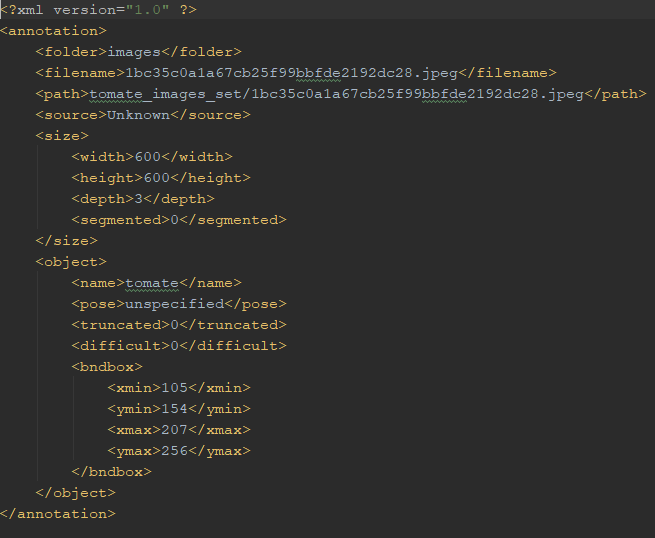
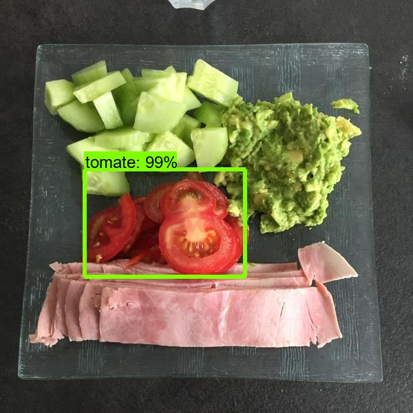
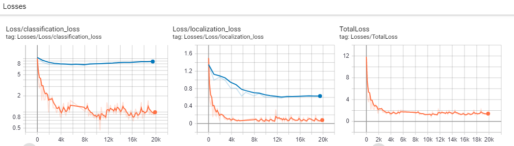
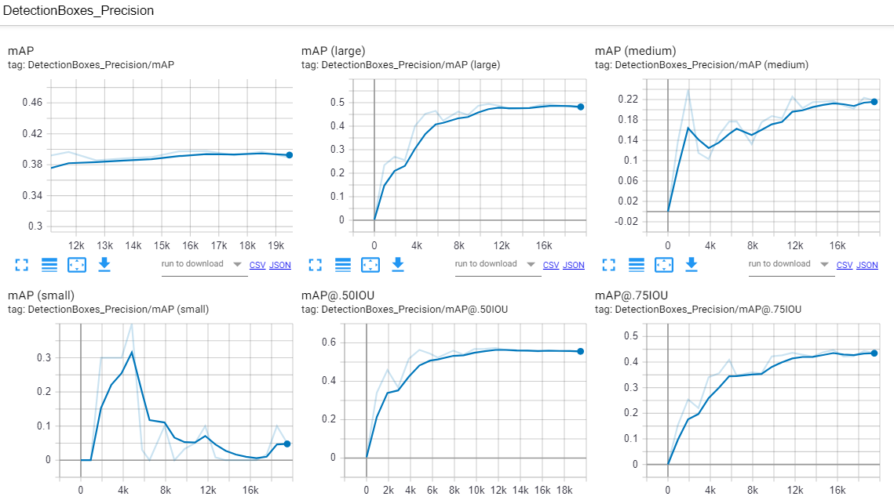
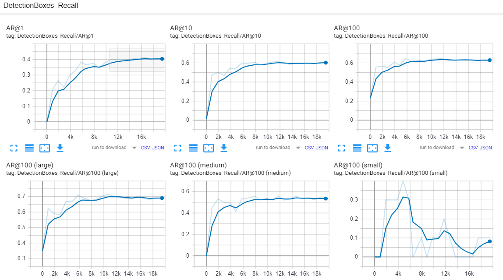
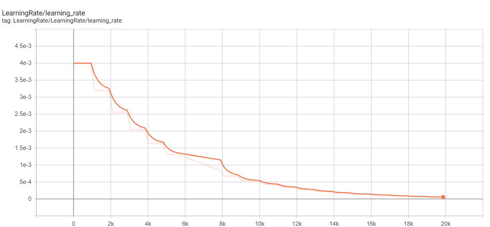

# homework

Ce test contient 2 parties:

  [1. Test programmation: Coding assignment](#coding-assignment)
  
  [2. Projet sur vision par ordinateur: Tomato allergies](#home-assignment---tomato-allergies)
  
## Coding assignment

Ce test issu de [Coding assignment - Food database](https://github.com/Foodvisor/coding-assignment). 
le répertoire [Code_assignement](https://github.com/fengecho/homework/tree/master/Coding_assignment) contient 3 fichiers suivants:
- `database.py`: il contient un class `Database`
- `test.py` : code à tester les 2 exemples fournis par le sujet
- `test_release.py` : code à tester les données issues de [release](https://github.com/Foodvisor/coding-assignment/releases/tag/v0.1.0)

### Run
pour utiliser les codes, il suiffit de télécharger les 3 fichiers du répertoire [Code_assignement](https://github.com/fengecho/homework/tree/master/Coding_assignment) et de les mettre ensemble dans un répertoire. Vous pouvez taper `python test.py`,  `python test_release.py` pour les exécuter sur **terminal** ou **command windows** ou bien Run les fichier `python test.py`,  `python test_release.py` directement sur un logicielle comme **Pycharme**


## Home assignment - Tomato allergies

Ce test issu du sujet [Home assignment - Tomato allergies - Assignment # 1](https://github.com/Foodvisor/home-assignment#assignment--1)
je l'ai fait en **Tensorflow 1.14**, pre-trained model [ssd_mobilenet_v1_coco_2018_01_28](http://download.tensorflow.org/models/object_detection/ssd_mobilenet_v1_coco_2018_01_28.tar.gz). Le model est entraîné sur AWS EC2 avec la carte graphique Tesla K80. Il contient 2 parties:
- [Training](#training)
- [Test](#test)


### Training 

1. Extraire les donnée

Le dataset fourni par le auteur est au total 3000 images, ils sont mélangés(images avec tomates ou sans tomates). Les 2 fichier sont également fournis:
 - **img_annotations.json** : il contient les informations des 3000 images dans le dataset, y compris noms des images, leur bounding boxes et noms des différents aliments qui sont contournés par leur bounding boxes.
 - **label_mapping.sv** : label ID des aliments et son nom correspondant.
 
Comme nous voulons détecter les tomates entiers ou en morceau(pas le jus), nous devons trouver les labels qui représent les tomates entiers ou en morceau. En faisant la recherche, j'ai trouvé 5 labels qui représentent les tomates entiers ou en morceau, Ils sont:
- 939030726152341c154ba28629341da6_lab,Tomates (coupées),Tomatoes
- 9f2c42629209f86b2d5fbe152eb54803_lab,Tomates cerises,Cherry tomatoes
- 4e884654d97603dedb7e3bd8991335d0_lab,Tomates (entières),Tomatoe whole
- f3c12eecb7abc706b032ad9a387e6f01_lab,Tomate à la provençale,Stuffed Tomatoes
- e306505b150e000f5e1b4f377ad688a0_lab,Tomate farcie,Stuffed tomatoes

A partir des 5 labels, j'ai écrit [write_tomate_image.py](Tomato_allergies/Assignment_1/training/construire_dataset/write_tomate_image.py), ce fichier extraire les noms des images, leur bouding boxes et leur labels dans une autre fichier `.json` à condition que ces image contiennent un ou plusieurs labels de ces 5 labels. Après, on obtient [tomate_image.json](Tomato_allergies/Assignment_1/training/construire_dataset/tomate_image.json), un fichier qui contient tous les informations des images qui ont tomate dedans.

2. Extraire les images de tomate et construire fichiers .xml

Le fichier [extraire_image.py](Tomato_allergies/Assignment_1/training/construire_dataset/extraire_image.py) sert à extraire les images de tomate depuis le répertoire **assignment_imgs** au répertoire **tomate_images_set**. Les images extraites sont au total 500.

Avant de passer au dernier étape pour contruire **.record** qui est le format de dataset pour Tensorflow, nous devons générer les **.xml** fichiers, ce fichier **.xml** contient le nom d'image, les boundingboxes et l'information d'image, voici un exemple de **.xml**  

  <p>
  
  </p> 
  
Le fichier [generate_xml.py](Tomato_allergies/Assignment_1/training/construire_dataset/generate_xml.py) prend [tomate_image.json](Tomato_allergies/Assignment_1/training/construire_dataset/tomate_image.json) comme entrée, les **.xml** seront enregistrés dans le répertoire indiqué dans le code(dans notre cas, le fichier **annotation**).
  
3. Séparation des .xml en partie **Training** et partie **Validation**

Le fichier [train_test_split.py](Tomato_allergies/Assignment_1/training/construire_dataset/train_test_split.py) est crée pour trier au harard les **.xml** au training, validation et test(ou seulement training et validation). Dans notre cas, comme la quantité d'images est seulement 500, donc j'ai séparé 441 images pour **Training**, 49 images pour **Validation** et 10 images pour le **Test** , il sont stocké dans le répertoire [train_val](Tomato_allergies/Assignment_1/training/construire_dataset/train_val)
  
4. Transformer les fichiers **.xml** au fichier **.csv** et générer les fichiers **.record**

Le fichier [xml_to_csv.py](Tomato_allergies/Assignment_1/training/construire_dataset/xml_to_csv.py) transforme les fichier **.xml** au fichiers **.csv**, puis on utilise [generate_tfrecord.py](Tomato_allergies/Assignment_1/training/construire_dataset/generate_tfrecord.py) pour générer les fichier **.record**, les lignes de commande sont comme suivante:
  
  ```shell
  $ python generate_tfrecord.py --csv_input=data/train_labels.csv  --output_path=data/train.record
  $ python generate_tfrecord.py --csv_input=data/validation.csv  --output_path=data/validation.record
  ```
On obtient ainsi `train.record` et `validation.record`
  
5. Installation de **Tensorflow object-detection API**, vous trouvez les instruction à installer ce API en liens suivant [Tensorflow object-detectuib API](https://github.com/tensorflow/models/tree/6518c1c7711ef1fdbe925b3c5c71e62910374e3e/research/object_detection)
  
6. Télécharger le model pre-traind **ssd_mobilenet_v1_coco_2018_01_28** dans le liens http://download.tensorflow.org/models/object_detection/ssd_mobilenet_v1_coco_2018_01_28.tar.gz, Décompresser ce model dan un nouveau répertoire nommé **checkpoint** (path: `models/research/object_detection/checkpoint` ), ***le répertoire **models** est le répertoire principal de Object Detection API***, on crée un répertoire nommée par exemple **tomate_training** (path: `models/research/object_detection/tomate_training`  ), placer `train.record` et `validation.record` dans un répertoire sous `models/research/object_detection/tomate_training/data`, on copie `object_detection/samples/configs/ssd_mobilenet_v1_pets.config` `object_detection/tomate_training/ssd_mobilenet/ssd_mobilenet_v1.config`, créer [label_map.pbtxt](Tomato_allergies/Assignment_1/training/label.pbtxt) sous `models/research/object_detection/tomate_training/data/`, écrire le contenu suivant:
  
  ```
  item {
  id: 1
  name: 'tomate'
}
```
On doit modifier quelque parties de ce fichier **ssd_mobilenet_v1.config** :
  - totalité de class à détecter, dans notre cas, il est 1 seul class à détecter
  - checkpoint path
  - label_map_path
  - input/output path
  
7. Créer `object_detection/tomate_training/ssd_mobilenet/train.sh`, Ecrire le contenu suivant: 
  
  ```
  mkdir -p logs/
  now=$(date +"%Y%m%d_%H%M%S")
  python ../../legacy/train.py \
      --logtostderr \
      --pipeline_config_path=ssd_mobilenet_v1.config \
      --train_dir=train_logs 2>&1 | tee logs/train_$now.txt &
 ```
 Pour lancer l'entraînement, taper `./train.sh`. Le nombre d'itération est fixé à 20 000 fois, **learning rate** est initialisé à 4e-3, il décroît en fonction d'itération 
 
 8. Créer `object_detection/tomate_training/ssd_mobilenet/eval.sh`, Ecrire le contenu suivant:
 ```
 mkdir -p eval_logs
 python ../../legacy/eval.py \
    --logtostderr \
    --pipeline_config_path=ssd_mobilenet_v1.config \
    --checkpoint_dir=train_logs \
    --eval_dir=eval_logs &
```
Nous pouvons lancer validation en même temp que l'entraînement en tapant `./eval.sh`. Si vous avez plusieurs GPU, taper `CUDA_VISIBLE_DEVICES="1" ./eval.sh`

9. Pour visualiser l'entraînement et validation, nous écrivons le contenu au dessous, visiter http://localhost:6006/ pour regarder

```
## From models/research/object_detection/tomate_training/ssd_mobilenet/
# visualiser l'entraînement
tensorboard --logdir train_logs/  

# visualiser la validation
tensorboard --logdir eval_logs/ --port 6007

#visualiser l'entraînement et la validation en même temps
tensorboard --logdir .
```
 
 
### Test
Pendant l'entraînement, le system enregistre plusieurs fois les fichiers de checkpoint, ils sont de type:
- graph.pbtxt
- model.ckpt-17538.data-00000-of-00001
- model.ckpt-17538.index
- model.ckpt-17538.meta
  ...

Pour obtenir un des checkpoints qu'on veut, il suffit d'exécuter le fichier `export_inference_graph.py`, il va enregistrer le checkpoint souhaité et générer un **frozen graph**

1. Tester avec fonction `has_tomatoes(image_path)`

 Mettre ensemble le fichier [run_tomatoes_detection.py](Tomato_allergies/Assignment_1/run_tomatoes_detection.py), [tomatoes_detection.py](Tomato_allergies/Assignment_1/tomatoes_detection.py) et le répertoire **model_exported** dans un répertoire. Les models entraînés sont dans le répertoire **model_exported**. Télécharger les models à [release] (https://github.com/fengecho/homework/releases/tag/V1.0), Pour l'éxecuter, vous devez avoir préalablement **sys**, **numpy**, **cv2**, **tesorflow** dans votre environement Python. Dans le fichier [tomatoes_detection.py](Tomato_allergies/Assignment_1/tomatoes_detection.py), vous trouvez la fonction `has_tomatoes()`, aussi un seuil(par défault à 0.5) à scores pour filtrer les résultats. Remplir le `image_path` dans le fichier [run_tomatoes_detection.py](Tomato_allergies/Assignment_1/run_tomatoes_detection.py), puis taper command `python run_tomatoes_detection.py` au **terminal/commmand windows**. 
 
 Résultat: Si il a détecté les tomates dans l'image, il va retourner "True, there is/are tomatoes", sinon il va retourner "No, there is not tomato".


2. Tester avec le fichier [detect_image.py](Tomato_allergies/Assignment_1/detect_image.py) 

Ce fichier prend le chemin d'un répertoire qui contient les images à detecter, il sort les images détectés avec les boundingboxes dessinés au dessus dans un répertoire [output_images](Tomato_allergies/Assignment_1/output_images).
Pour l'éxecuter, vous devez avoir préalablement **sys**, **numpy**, **cv2**, **tesorflow** dans votre environement python, **Object Detection API** doit être ajouté dans le PYTHONPATH:

```
#From models/research 
export PYTHONPATH=$PYTHONPATH:`pwd`:`pwd`/slim
```
Placer ensemble le répertoire [test_images](Tomato_allergies/Assignment_1/test_images) et le fichier [detect_image.py](Tomato_allergies/Assignment_1/detect_image.py) dans un répertoire, puis taper le commande `python detect_image.py test_images`
Voici un exemple de résultat:
  <p>
  
  </p> 


3. Les graphes


La graphe de **losses**, le trait rouge représente loss d'entraînement, le trait bleu représente loss d'évaluation.

<p>
  
 </p> 


Le **mAP** graph de l'évaluation (mAP: mean Average Precision) 

 <p>
  
 </p> 


Le **AR** graph de l'évaluation (AR: Average Recall)

 <p>
  
 </p> 
 
 
 
 Le graph de **learning rate**
 
  <p>
  
 </p> 
 
 
 ### Référence
 
 [使用TensorFlow Object Detection API进行物体检测](https://lijiancheng0614.github.io/2017/08/22/2017_08_22_TensorFlow-Object-Detection-API/#%E5%87%86%E5%A4%87)
 
 [hand-detection-tutorial](https://github.com/jkjung-avt/hand-detection-tutorial)
 
 [Tensorflow Object Detection API](https://github.com/tensorflow/models/tree/6518c1c7711ef1fdbe925b3c5c71e62910374e3e/research/object_detection)
 
 [从零开始机器学习-3 教会你的AI识别特定的物体](https://www.jianshu.com/p/b9f84f5384ca)
 
 [How to train your own Object Detector with TensorFlow’s Object Detector API](https://towardsdatascience.com/how-to-train-your-own-object-detector-with-tensorflows-object-detector-api-bec72ecfe1d9)
 
 

## Release
Le model entraîné est déposé sous [release](https://github.com/fengecho/homework/releases/tag/V1.0). Pour detecter l'image, il suffit télécharger seulement le fichier **frozen_inference_graph.pb**, mettre ce fichier dans un répertoire nommé model_exported, déposer ce répertoire dans le même répertoire que les fichiers`.py` qui servent à détecter 
